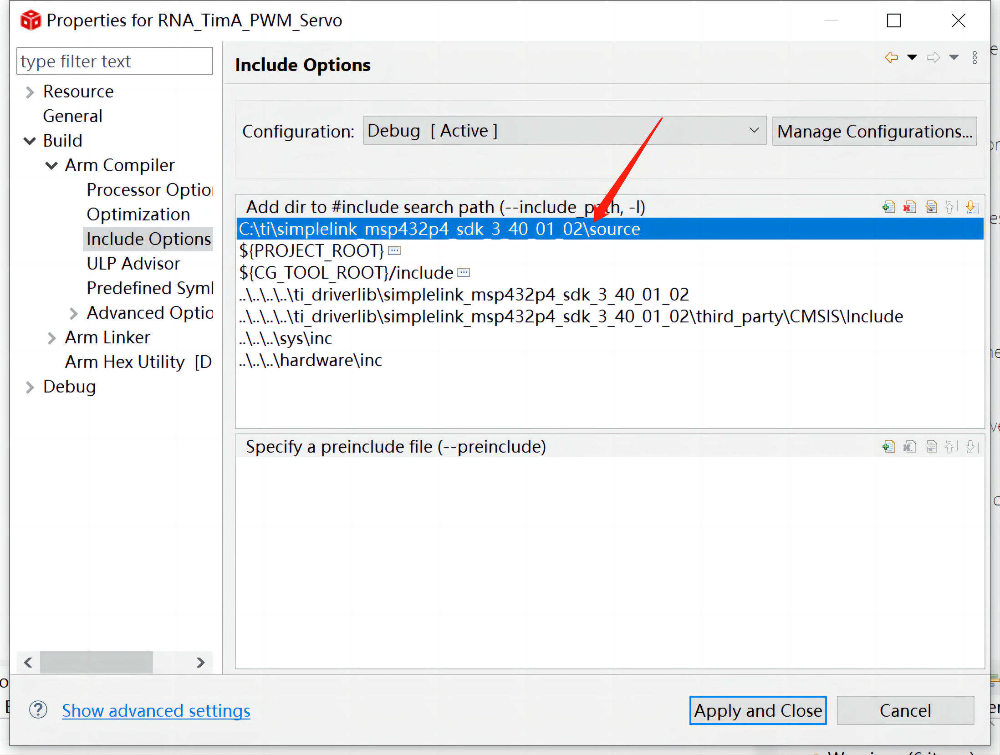

所有的CCS和SDK建议放在 同一个文件夹里

具体细节参看
https://www.bilibili.com/video/BV1Rb4y1z7KJ?p=1&vd_source=f55e9b0a7c1da847b04085ba57aed552

com.ti.SIMPLELINK_MSP432_SDK v3.40.1.02

simplelink_msp432p4_sdk_3_40_01_02

以上两个应该是一样的东西，这个SDK得配置一下，不然会报错说找不到SDK

/* DriverLib Includes */

//外设驱动库DriverLib 头文件包含

//如果编译此处出错，请查看工程的设置，看下是否把SDK路径包含进来

//Properties / Build / ARM Compiler / Include Options

#include 

怎么配置呢，Alt+Enter 进入工程properties

最后把路径修改到你的SDK 安装路径下的source文件夹

5.19 发现同样的工程 keil可编译下载 function 但ccs只能编译 下载未报错但没反应 暂时不知道如何解决（怀疑是RNA工程本身的问题，尝试ti给的标准例程都没问题，此处于6.5更新）
