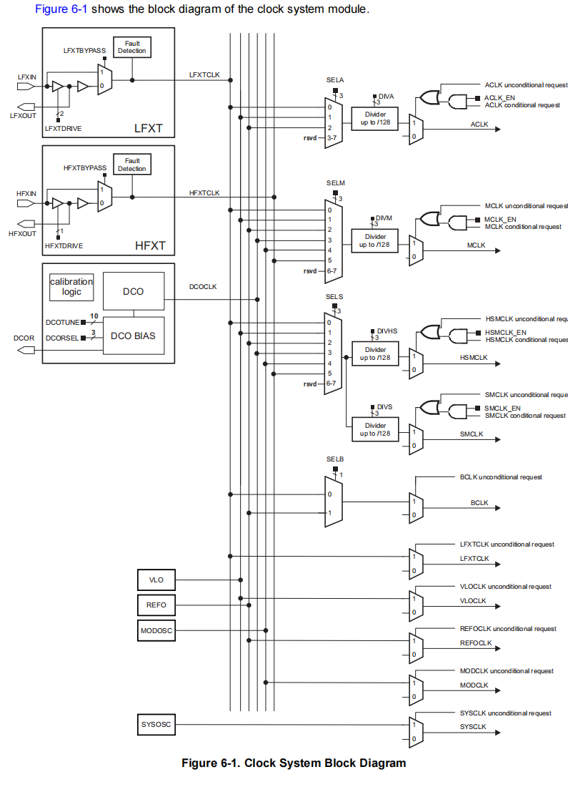
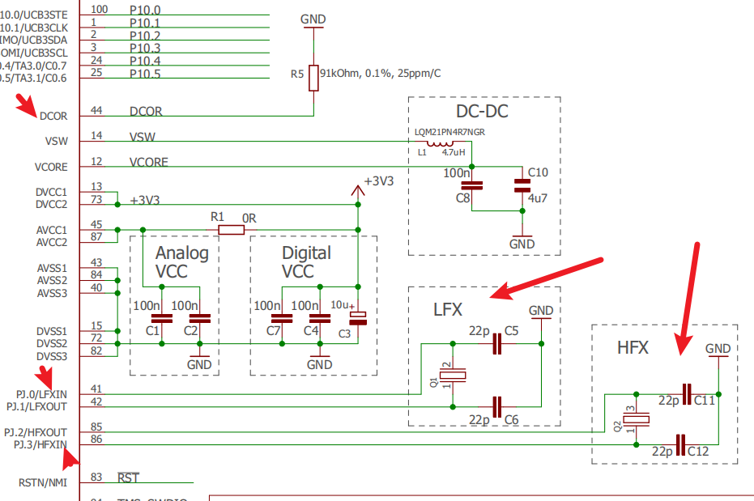
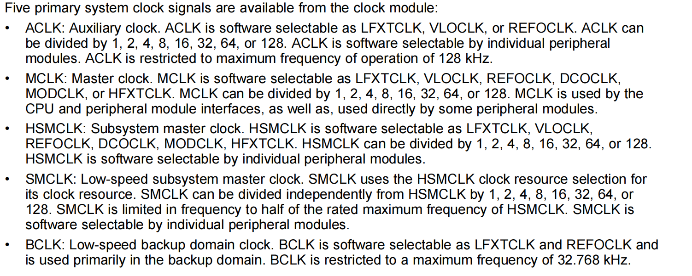
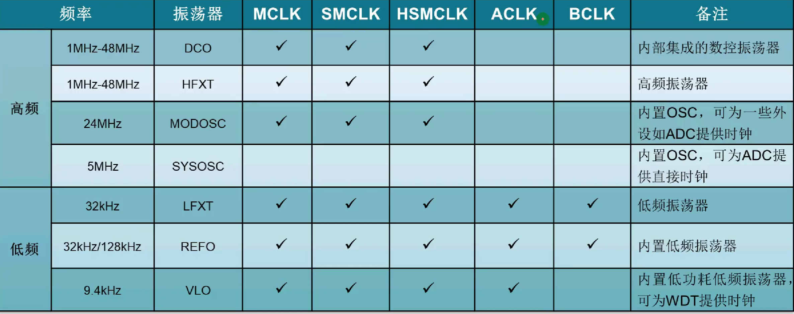
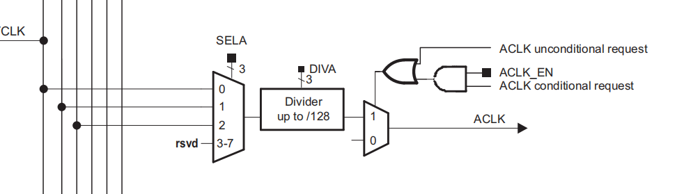
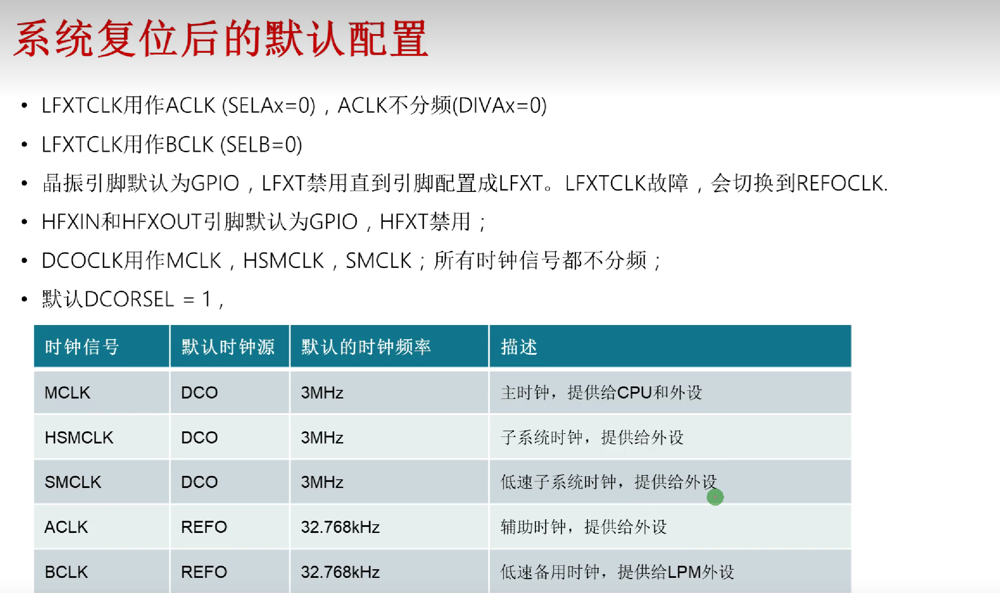
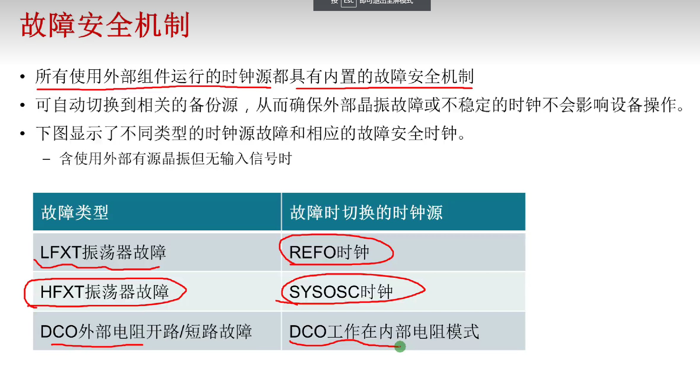
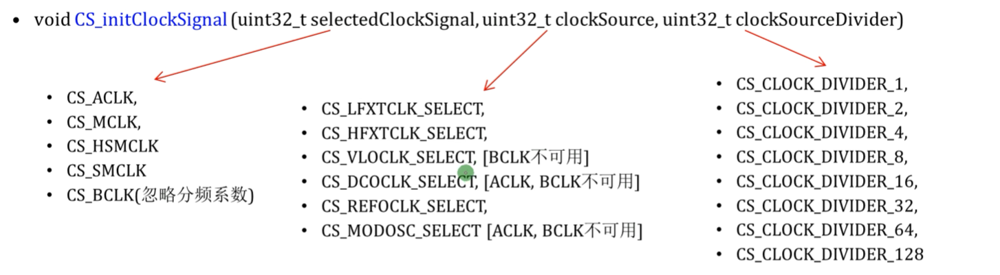

    时钟配置，在我们需要做分频的时候，特别是计算频率时非常重要。有必要花时间做一个对照表来进行学习

    总览图（源于用户手册slau356.h 380页）

    时钟源与时钟信号，这部分来自于slau356.h
        时钟源
            1. LFXLCLK
            2. HFXTCLK
            3. DCOCLK
            4. VLO
            5. REFO
            6.MODOSC

        时钟信号
            1. ACLK
            2. MCLK
            3. HSMCLK
            4. SMCLK
            5. BCLK
            6. LFXTCLK
            7. VLOCLK
            8. REFOCLK
            9.MODCLK
            10. SYSCLK

    硬件电路（来自slau597.f）

**这里发现在tab下加粗不了，但也要标注出来引以为戒**

    振荡器介绍（基于时钟源，除了SYSOSC，看图可知）
        1-LFXT：支持**32.768kHz**低频晶振
        2-HFXT：高频晶振，**1~48MHz**；
        3-DCO：内部振荡器，可产生高达**48MHz**的频率。使用外部精密电阻时，DCO还支持高精度模式
        4-VLO：VLO是一款超低功耗内部振荡器，可产生典型频率为**9.4kHz**的低精度时钟。
        5-REFO：**32.768 kHz**时钟，可作为LFXT的备用低功耗低精度源。 REFO也可以编程为产生**128 kHz**时钟
        6-MODOSC:MODOSC是一个内部时钟源，具有非常低的延迟唤醒时间。 它的出厂校准频率为25 MHZ。MODOSC通常用于向不同模块提供“请求时钟”。 它可以用作1 Msps采样率的ADC操作的时钟源
        7-SYSOSC:SYSOSC是一个内部时钟源，出厂校准频率为5 MHZ。 它可以200 ksps采样率用作ADC操作的时钟源。 此外，SYSOSC还用于各种系统级控制和管理操作的定时，不接在总线上

    时钟信号配置
        总览如下 

        
        对应可配置关系

        ACLK（Auxiliary clock）
            可以配置LFXTCLK;VLO;REFO  ，可分频

        MCLK（master时钟）
            前六者均可配置

        HSMCLK（子系统时钟）
            前六者均可配置

        SMCLK（低速子系统时钟）
             基于HSMCLK进行分频  频率限制最大为HSMCLK的一半 那到底能分频多少呢？疑问

        BCLK
            最大频率32768Hz 不分频

**系统复位时的默认配置 做到心中有数**

故障的安全机制

# 非常重要

函数理解

    void CS_initClockSignal(uint32_t selectedClockSignal,uint32_t clockSource, uint32_t clockSourceDivider);

注意到这个函数不包括REFOCLK

    void CS_setReferenceOscillatorFrequency(uint8_t referenceFrequency); 这才是配置参考时钟的函数，CS_REFO_32KHZ或者CS_REFO_128KHZ

    6.8日更新到这里，之后会进一步配置研究。时钟还有很多，比如计数，中断，DCO配置，留给日后研究
