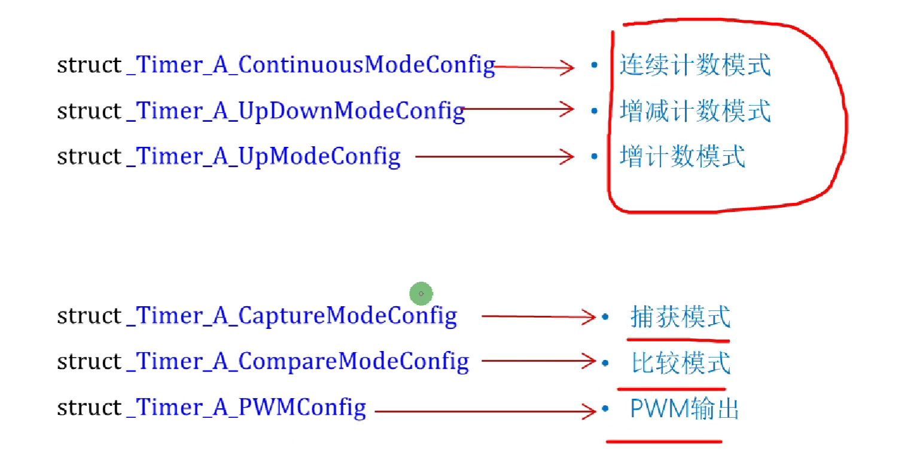
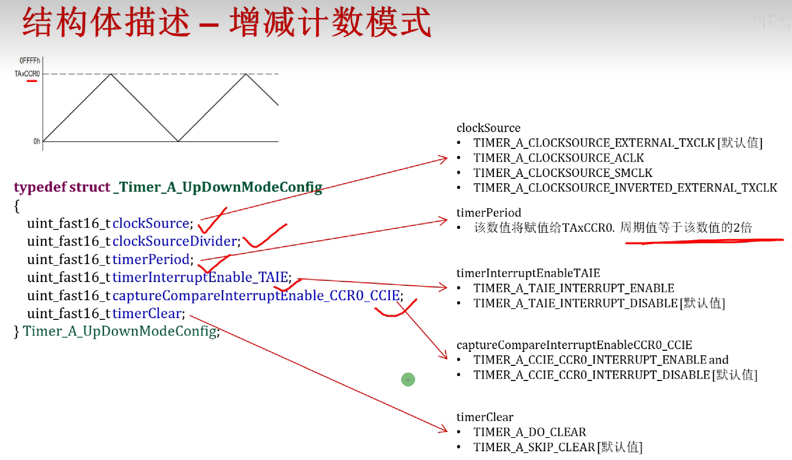
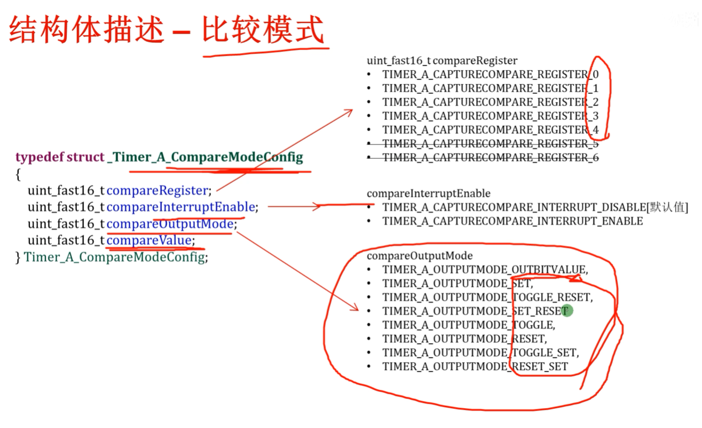

三种计数，三个功能

    整体

    连续计数模式

        typedef struct _Timer_A_ContinuousModeConfig
        {
            uint_fast16_t clockSource;
            uint_fast16_t clockSourceDivider;
            uint_fast16_t timerInterruptEnable_TAIE;
            uint_fast16_t timerClear;
        } Timer_A_ContinuousModeConfig;

    增计数模式

        typedef struct _Timer_A_UpModeConfig
        {
            uint_fast16_t clockSource;
            uint_fast16_t clockSourceDivider;
            uint_fast16_t timerPeriod;
            uint_fast16_t timerInterruptEnable_TAIE;
            uint_fast16_t captureCompareInterruptEnable_CCR0_CCIE;
            uint_fast16_t timerClear;
        } Timer_A_UpModeConfig;

    增减计数模式
        typedef struct _Timer_A_UpDownModeConfig
        {
            uint_fast16_t clockSource;
            uint_fast16_t clockSourceDivider;
            uint_fast16_t timerPeriod;
            uint_fast16_t timerInterruptEnable_TAIE;
            uint_fast16_t captureCompareInterruptEnable_CCR0_CCIE;
            uint_fast16_t timerClear;
        } Timer_A_UpDownModeConfig;

    比较模式
        结构体配置
        typedef struct _Timer_A_CompareModeConfig
        {
            uint_fast16_t compareRegister;
            uint_fast16_t compareInterruptEnable;
            uint_fast16_t compareOutputMode;
            uint_fast16_t compareValue;
        } Timer_A_CompareModeConfig;
        相关函数概览

    捕获模式
        结构体配置
        typedef struct _Timer_A_CaptureModeConfig
        {
            uint_fast16_t captureRegister;
            uint_fast16_t captureMode;
            uint_fast16_t captureInputSelect;
            uint_fast16_t synchronizeCaptureSource;
            uint_fast8_t captureInterruptEnable;
            uint_fast16_t captureOutputMode;
        } Timer_A_CaptureModeConfig;

    PWM输出模式
        结构体配置
            typedef struct _Timer_A_PWMConfig
            {
                uint_fast16_t clockSource;
                uint_fast16_t clockSourceDivider;
                uint_fast16_t timerPeriod;
                uint_fast16_t compareRegister;
                uint_fast16_t compareOutputMode;
                uint_fast16_t dutyCycle;
            } Timer_A_PWMConfig;

    中断相关

三种计数模式的配置与工作
    注意，先配置，配置好了还需要启动工作，才能干活儿，如图所示

实战例程分析-直接调用库函数产生波形（PWM模式）
    首先做一个数据计算
        由后文可知，我们设置的时钟是64kHz，也就是一秒运转64k下，于是，我们的时间周期设置为32000，也就是0.5s一个，所以波形周期是2Hz。在时钟周期给定的情况，比如64hz，那么，timeperiod的值就是64000除以我们需要的Hz。比如，我们要测量并输出1000Hz的方波，那timeperiod=64 关于时钟，可以参考​时钟配置概览​ 

    鉴于篇幅，只讲述核心代码
        首先是结构体的配置，我们配置2个PWM结构体变量，做双路PWM波形输出
            Timer_A_PWMConfig pwmConfig =
            {
                    TIMER_A_CLOCKSOURCE_SMCLK,
                    TIMER_A_CLOCKSOURCE_DIVIDER_1,
                    32000,
                    TIMER_A_CAPTURECOMPARE_REGISTER_1,
                    TIMER_A_OUTPUTMODE_RESET_SET,
                    3200
            };
            第二个
                Timer_A_PWMConfig pwm_2_Config =
                {
                        TIMER_A_CLOCKSOURCE_SMCLK,
                        TIMER_A_CLOCKSOURCE_DIVIDER_1,
                        32000,
                        TIMER_A_CAPTURECOMPARE_REGISTER_2,
                        TIMER_A_OUTPUTMODE_RESET_SET,
                        3200
                };

        //![Simple Timer_A Example] /* Setting MCLK to REFO at 128Khz for LF mode Setting SMCLK to 64Khz */
                MAP_CS_setReferenceOscillatorFrequency(CS_REFO_128KHZ);
                MAP_CS_initClockSignal(CS_MCLK, CS_REFOCLK_SELECT, CS_CLOCK_DIVIDER_1);
                MAP_CS_initClockSignal(CS_SMCLK, CS_REFOCLK_SELECT, CS_CLOCK_DIVIDER_2);
                MAP_PCM_setPowerState(PCM_AM_LF_VCORE0);

        /* Configuring GPIO2.4 and GPIO2.5 as peripheral output for PWM  and P1.1 for button  interrupt */
                MAP_GPIO_setAsPeripheralModuleFunctionOutputPin(GPIO_PORT_P2, GPIO_PIN4,GPIO_PRIMARY_MODULE_FUNCTION);
                MAP_GPIO_setAsPeripheralModuleFunctionOutputPin(GPIO_PORT_P2, GPIO_PIN5,GPIO_PRIMARY_MODULE_FUNCTION);
                MAP_GPIO_setAsInputPinWithPullUpResistor(GPIO_PORT_P1, GPIO_PIN1);
                MAP_GPIO_clearInterruptFlag(GPIO_PORT_P1, GPIO_PIN1);
                MAP_GPIO_enableInterrupt(GPIO_PORT_P1, GPIO_PIN1);

        /* Configuring Timer_A to have a period of approximately 500ms and an initial duty cycle of 10% of that (3200 ticks)  */
            MAP_Timer_A_generatePWM(TIMER_A0_BASE, &pwmConfig);
            MAP_Timer_A_generatePWM(TIMER_A0_BASE, &pwm_2_Config);

        /* Enabling interrupts and starting the watchdog timer */
            配置总中断
                    MAP_Interrupt_enableInterrupt(INT_PORT1);
                    MAP_Interrupt_enableSleepOnIsrExit();
                    MAP_Interrupt_enableMaster();

        /* Port1 ISR - This ISR will progressively step up the duty cycle of the PWM on a button press*/
            因为我们的按键是GPIO_PORT_P1,GPIO_PIN1,即P1.1，所以如下中断
            中断配置
                void PORT1_IRQHandler(void)
                {
                    uint32_t status = MAP_GPIO_getEnabledInterruptStatus(GPIO_PORT_P1);
                    MAP_GPIO_clearInterruptFlag(GPIO_PORT_P1, status);
                    if (status & GPIO_PIN1)
                    {
                        if(pwmConfig.dutyCycle == 28800)
                        {    pwmConfig.dutyCycle = 3200;
                        pwm_2_Config.dutyCycle =pwmConfig.dutyCycle;
                        }
                        else
                        {
                            pwmConfig.dutyCycle += 3200;
                            pwm_2_Config.dutyCycle = pwmConfig.dutyCycle;
                        }
                        MAP_Timer_A_generatePWM(TIMER_A0_BASE, &pwmConfig);
                        MAP_Timer_A_generatePWM(TIMER_A0_BASE, &pwm_2_Config);
                    }
                }

    稍加改变，即可实现基于A0的四路P波输出
        四路P波输出完整代码存放处（内容较大，拷贝建议在官方例程的main里进行覆盖）
            基于官方例程的4路同等P波输出
                注意 需要魔法上网 (VPN)

    我们进一步，用按键设置频率巡回递减
        void PORT1_IRQHandler(void)
        {
            uint32_t status = MAP_GPIO_getEnabledInterruptStatus(GPIO_PORT_P1);
            MAP_GPIO_clearInterruptFlag(GPIO_PORT_P1, status);
            if (status & GPIO_PIN1)
            {
                if(pwmConfig.dutyCycle == 28800)
                {    pwmConfig.dutyCycle = 3200;
                pwm_2_Config.dutyCycle =pwmConfig.dutyCycle;
                pwm_3_Config.dutyCycle =pwmConfig.dutyCycle;
                pwm_4_Config.dutyCycle =pwmConfig.dutyCycle;
                }
                else
                {
                    pwmConfig.dutyCycle += 3200;
                    pwm_2_Config.dutyCycle = pwmConfig.dutyCycle;
                    pwm_3_Config.dutyCycle = pwmConfig.dutyCycle;
                    pwm_4_Config.dutyCycle = pwmConfig.dutyCycle;
                }
                MAP_Timer_A_generatePWM(TIMER_A0_BASE, &pwmConfig);
                MAP_Timer_A_generatePWM(TIMER_A0_BASE, &pwm_2_Config);
                MAP_Timer_A_generatePWM(TIMER_A0_BASE, &pwm_3_Config);
                MAP_Timer_A_generatePWM(TIMER_A0_BASE, &pwm_4_Config);
            }
        }

    增加一段
        if (status & GPIO_PIN4)
                {
                    if(pwmConfig.dutyCycle == 0)
                    {    pwmConfig.dutyCycle = 28800;
                    pwm_2_Config.dutyCycle =pwmConfig.dutyCycle;
                    pwm_3_Config.dutyCycle =pwmConfig.dutyCycle;
                    pwm_4_Config.dutyCycle =pwmConfig.dutyCycle;
                    }
                    else
                    {
                        pwmConfig.dutyCycle -= 3200;
                        pwm_2_Config.dutyCycle = pwmConfig.dutyCycle;
                        pwm_3_Config.dutyCycle = pwmConfig.dutyCycle;
                        pwm_4_Config.dutyCycle = pwmConfig.dutyCycle;
                    }
                    MAP_Timer_A_generatePWM(TIMER_A0_BASE, &pwmConfig);
                    MAP_Timer_A_generatePWM(TIMER_A0_BASE, &pwm_2_Config);
                    MAP_Timer_A_generatePWM(TIMER_A0_BASE, &pwm_3_Config);
                    MAP_Timer_A_generatePWM(TIMER_A0_BASE, &pwm_4_Config);
                }

    然后初始化按键  增加GPIO_PIN4 即可
        //button configuration
        MAP_GPIO_setAsInputPinWithPullUpResistor(GPIO_PORT_P1, GPIO_PIN1+GPIO_PIN4);
        MAP_GPIO_clearInterruptFlag(GPIO_PORT_P1, GPIO_PIN1+GPIO_PIN4);
        MAP_GPIO_enableInterrupt(GPIO_PORT_P1, GPIO_PIN1+GPIO_PIN4);

至此，我们实现了TimerA0 的四路PWM输出控制 6.8 实测可行
