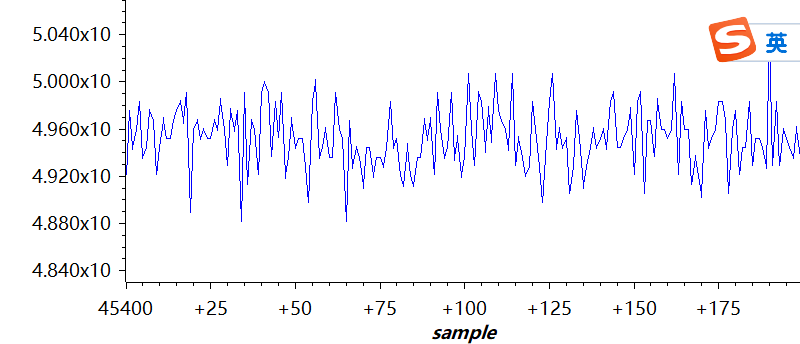
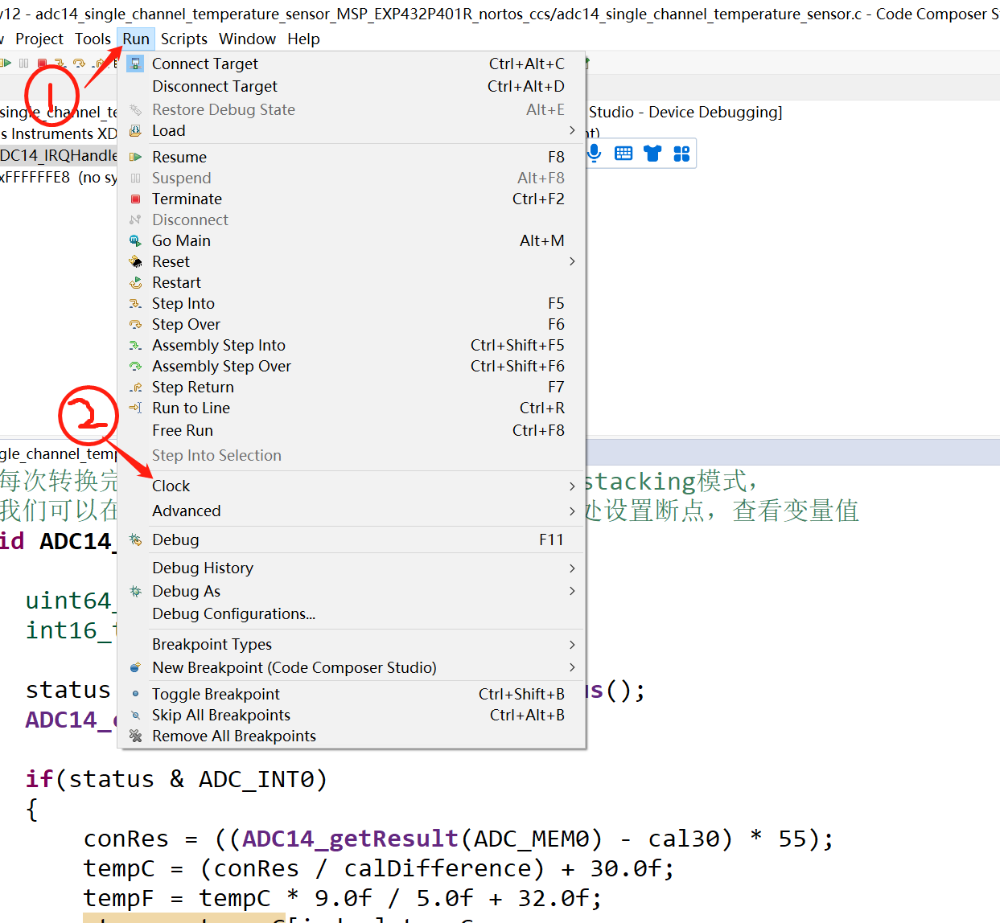
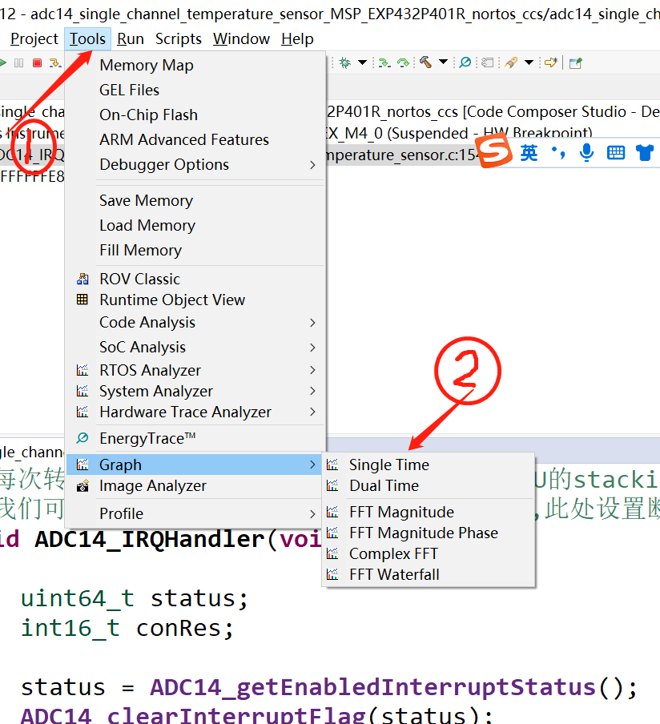

01-温度传感器例程

## 库文件导入，以及变量初始化定义

    /* DriverLib Includes */
    #include <ti/devices/msp432p4xx/driverlib/driverlib.h>

    /* Standard Includes */
    #include <stdint.h>

    #include <string.h>

    uint32_t cal30;
    uint32_t cal85;
    float calDifference;
    float tempC;
    float tempF;
    float storage_temp_C[200];
    int   index=0;

## （ int main函数+中断）分析

/* Halting WDT  */

        //常规操作 停用看门狗
            WDT_A_holdTimer();

        // 启用低功耗模式 和while(1)里面的 PCM_gotoLPM0(); 配合 PCM的意思是电源管理 记得留一个印象
             Interrupt_enableSleepOnIsrExit();

/* Enabling the FPU with stacking enabled (for use within ISR) */

        //使能浮点处理单元的函数 在ISR中用到过    
                FPU_enableModule();
                FPU_enableLazyStacking();

/* Initializing ADC (MCLK/1/1) with temperature sensor routed */

        //ADC初始化 (MCLK/1/1)，启用内部通道(温度传感器)
            ADC14_enableModule();
            ADC14_initModule(ADC_CLOCKSOURCE_MCLK, ADC_PREDIVIDER_1, ADC_DIVIDER_1, ADC_TEMPSENSEMAP);

/* Configuring ADC Memory (ADC_MEM0 A22 (Temperature Sensor) in repeat mode).*/

        //配置为单通道模式 多次采样转换
            ADC14_configureSingleSampleMode(ADC_MEM0, true);

        //输入通道A22(依数据手册,该通道为内部温度传感器)-->ADC MEMO，采用内部的参考电压,false表示非差分输入  参考电压应该是用来矫正
            ADC14_configureConversionMemory(ADC_MEM0, ADC_VREFPOS_INTBUF_VREFNEG_VSS,ADC_INPUT_A22, false);

// 差分输入

//#define ADC_NONDIFFERENTIAL_INPUTS           false

//
#define ADC_DIFFERENTIAL_INPUTS                     true

/* Configuring the sample/hold time for 192 */

        //设置指定内存寄存器范围的采样/保持时间。样本所需的持续时间因用户的硬件配置而异。
            //配置采样时间为192个ADC  为啥192个 据说可以计算 暂时不细致研究
                ADC14_setSampleHoldTime(ADC_PULSE_WIDTH_192,ADC_PULSE_WIDTH_192);

/* Enabling sample timer in auto iteration mode and interrupts*/

        //自动采样
            ADC14_enableSampleTimer(ADC_AUTOMATIC_ITERATION);

        //使能通道0
            ADC14_enableInterrupt(ADC_INT0);  //这个函数和之后的ISR中断处理函数有关联——if(status & ADC_INT0)

/* Setting reference voltage to 2.5 and enabling temperature sensor */

        设置参考电压为2.5V 并启用使能 以供校准配合使用
            REF_A_enableTempSensor();
            REF_A_setReferenceVoltage(REF_A_VREF2_5V);
            REF_A_enableReferenceVoltage();

        读取校准值
                cal30 = SysCtl_getTempCalibrationConstant(SYSCTL_2_5V_REF,SYSCTL_30_DEGREES_C);
                cal85 = SysCtl_getTempCalibrationConstant(SYSCTL_2_5V_REF,SYSCTL_85_DEGREES_C);
                calDifference = cal85 - cal30;

/* Enabling Interrupts */

        使能全程中断
            Interrupt_enableInterrupt(INT_ADC14);
            Interrupt_enableMaster();

/* Triggering the start of the sample */

        使能温度到电压的转换，并软件触发第一次，之后的次数会自动触发
            ADC14_enableConversion();
            ADC14_toggleConversionTrigger();

/* Going to sleep */

        进入低功耗模式
                while (1)
                {
                    PCM_gotoLPM0();
                }

/* This interrupt happens every time a conversion has completed. Since the FPU is enabled in stacking mode, we are able to use the FPU safely to perform efficient floating point arithmetic.*/

        //每次转换完成时，都会触发中断。因为使能了FPU的stacking模式，
        //我们可以在中断里边安全地执行高效的浮点运算,此处设置断点，查看变量值
            void ADC14_IRQHandler(void)
            {
                uint64_t status;
                int16_t conRes;
                status = ADC14_getEnabledInterruptStatus();//读取中断标志位值,存放到status中
                ADC14_clearInterruptFlag(status);//清零，释放资源
                if(status & ADC_INT0)//判断中断类型
                {
                    conRes = ((ADC14_getResult(ADC_MEM0) - cal30) * 55);
                    tempC = (conRes / calDifference) + 30.0f;
                    tempF = tempC * 9.0f / 5.0f + 32.0f;
                    storage_temp_C[index]=tempC;
                    index++;
                    if(index>199)
                        index=0;
                }
            }

### 效果展示

        调试方法见视频
<https://www.bilibili.com/video/BV18h411B7Fz?p=4&vd_source=f55e9b0a7c1da847b04085ba57aed552>

测定结果

clock设置

图像显示（需要先建立数组） 

首地址设置为数据名称即可 

其他条件配置一下即可显示

选择single time

