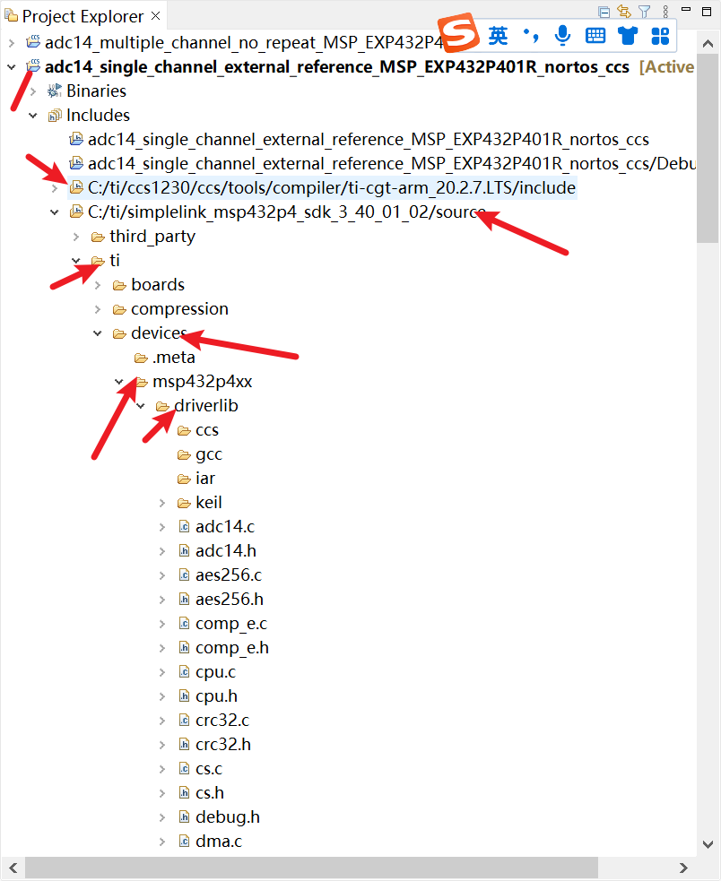
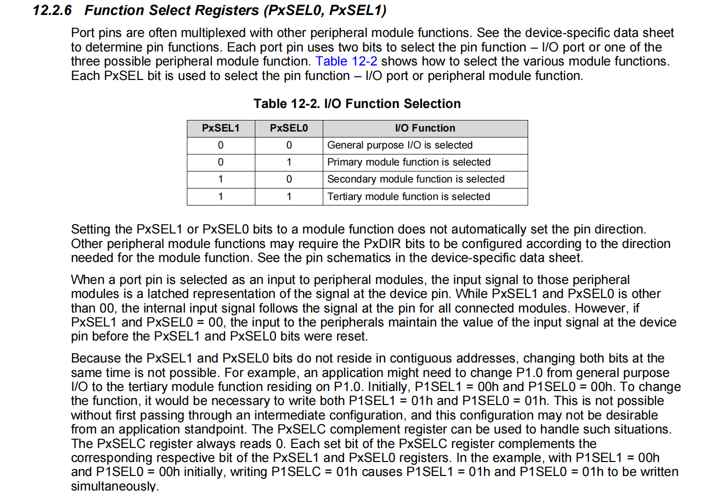
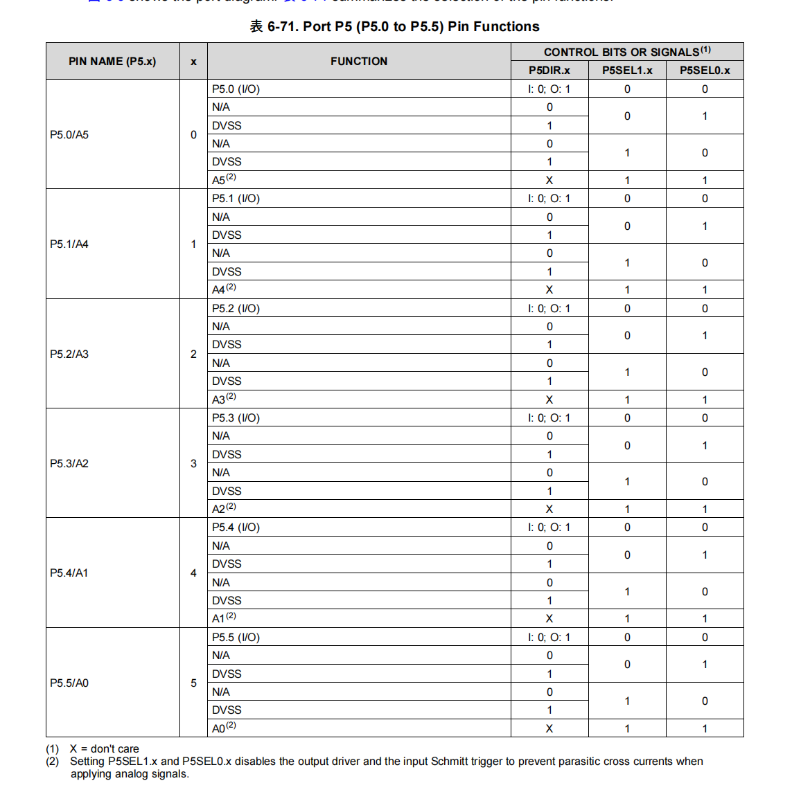
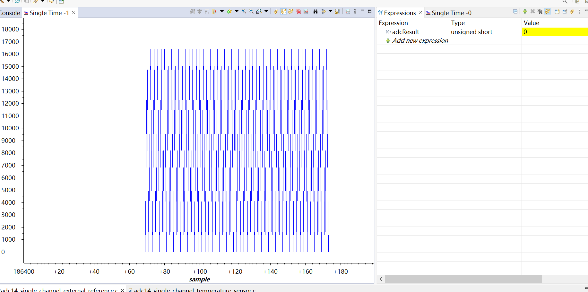
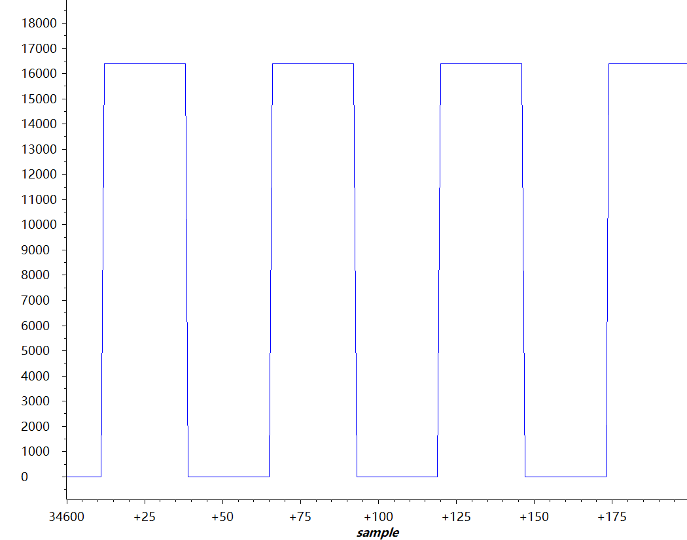

### 首先，跟stm系列的单片机不同的是，ti的msp432似乎已经吧所有的库集成好了.
### 但确实都是底层的函数，真要使用还是得自己编写，或者移植。

代码分析

/* Halting WDT  */ 

        //常规操作 停用看门狗
            WDT_A_holdTimer();

        // 启用低功耗模式 和while(1)里面的 PCM_gotoLPM0(); 配合
             Interrupt_enableSleepOnIsrExit();

/* Enabling the FPU with stacking enabled (for use within ISR) */

        //使能浮点处理单元的函数 在ISR中用到过    
                FPU_enableModule();
                FPU_enableLazyStacking();
        //这一部分不需要的，因为没有运算，为了节约功率可以删去

//![Simple ADC14 Configure]
/*Initializing ADC (MCLK/1/1)*/

        /ADC初始化 (MCLK/1/1)不起用内部通道 ADC_NOROUTE
            ADC14_enableModule();
            ADC14_initModule(ADC_CLOCKSOURCE_MCLK, ADC_PREDIVIDER_1, ADC_DIVIDER_1,ADC_NOROUTE);

/* Configuring ADC Memory (ADC_MEM0 A0/A1) in repeat mode with use of external references */

        单通道，多次转换，配置ADC存储寄存器A0 外部基准，非差分输入
            ADC14_configureSingleSampleMode(ADC_MEM0, true);
            ADC14_configureConversionMemory(ADC_MEM0, ADC_VREFPOS_EXTPOS_VREFNEG_EXTNEG, ADC_INPUT_A0, false);

/* Setting up GPIO pins as analog inputs (and references) */

        配置GPIO模拟输入引脚    GPIO_TERTIARY_MODULE_FUNCTION  第三输入，用于模拟输入展示.
//第一输出应该是GPIO 具体还没查到（6.9日更新）**已查到，具体配置见内部（6.10更新）**

            GPIO_setAsPeripheralModuleFunctionInputPin(GPIO_PORT_P5,GPIO_PIN7 | GPIO_PIN6 | GPIO_PIN5 | GPIO_PIN4, GPIO_TERTIARY_MODULE_FUNCTION);

//详细分析 主要是两个寄存器 PxSEL0与PxSEL1

// PxSEL0与PxSEL1决定是第几等级的输出

//**详细见**【MSP432P401R功能引脚的配置说明】
//<https://www.bilibili.com/video/BV1Fv411J7zq?vd_source=c0edb8fdfe8e4d718a596f7c407a4914>

/* Enabling sample timer in auto iteration mode and interrupts*/

        //自动采样
            ADC14_enableSampleTimer(ADC_AUTOMATIC_ITERATION);

        //使能通道0
            ADC14_enableInterrupt(ADC_INT0);  //这个函数和之后的ISR中断处理函数有关联——if(status & ADC_INT0)

/* Enabling Interrupts */

        使能全程中断-注意，这里的函数保存在interrupt.h里
            Interrupt_enableInterrupt(INT_ADC14); //INT_ADC14是唯一一个AD模块的中断
            Interrupt_enableMaster();

/* Triggering the start of the sample */

        使能转换，并软件触发第一次，之后的次数会自动触发
            ADC14_enableConversion();
            ADC14_toggleConversionTrigger();

        /* Going to sleep */ 
        进入睡眠模式
                while (1)
                {
                    PCM_gotoLPM0();
                }

/This interrupt happens whenever a conversion has been completed and placed into ADC_MEM0./

        中断函数：
            void ADC14_IRQHandler(void)
            {
                uint64_t status;
                status = ADC14_getEnabledInterruptStatus();  //读取中断标志位值,存放到status中
                ADC14_clearInterruptFlag(status);   //清零，释放资源
                if(status & ADC_INT0) //判断中断类型
                {
                    adcResult = ADC14_getResult(ADC_MEM0);
                }
            }

效果展示

        总的评价是比较尴尬，可能是正点原子的信号发生器不行，也有可能是单通道单次转换的限制，也可能是没配置好外部参考电压，回头去216测测

        这里输入的是500Hz的方波，占空比50%
        实验室输入200Hz的方波，占空比50%
        还是勉勉强强可以的，这里我们暂时不进行等效采样，水平不足，可以画一个饼

