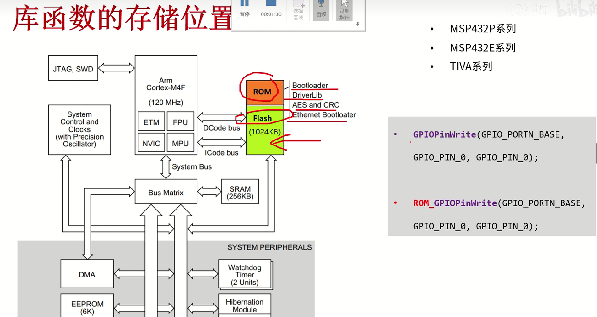
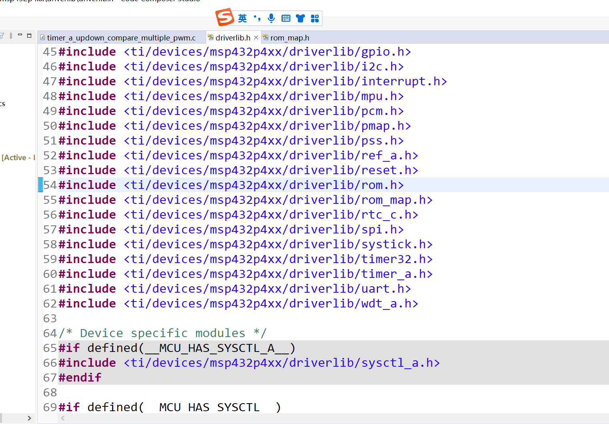
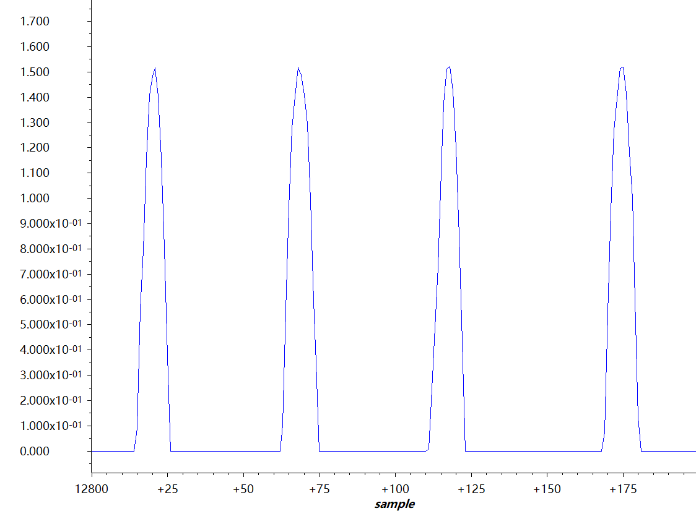
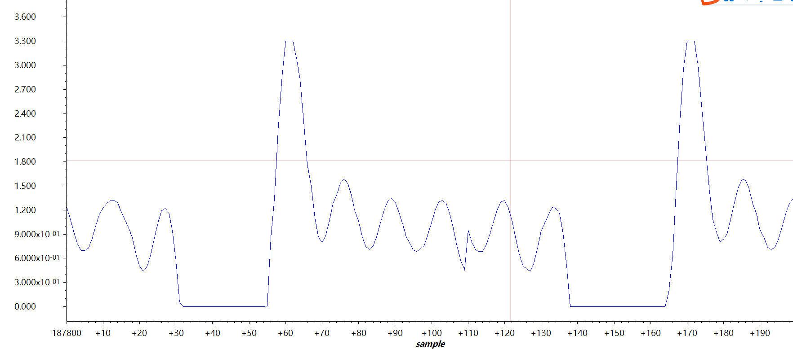
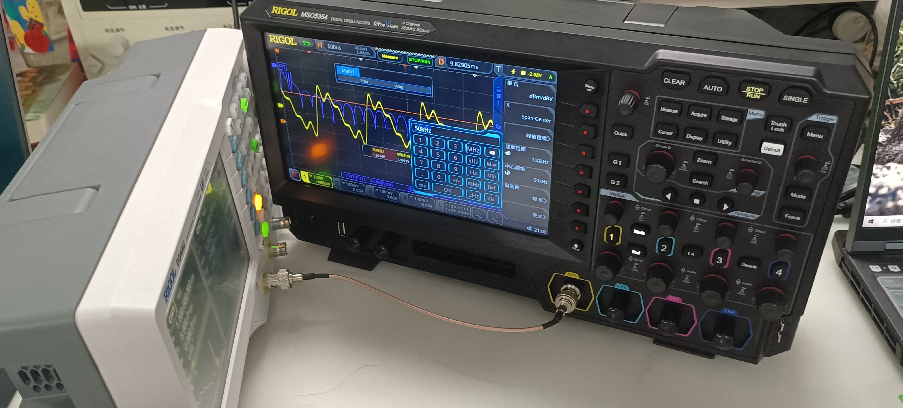
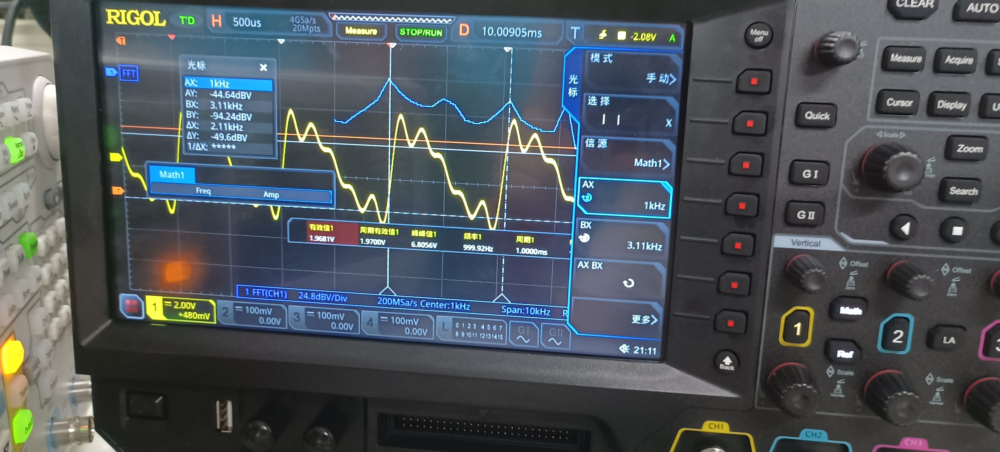

## 从这个项目开始，基本的配置到位，可以做为例程模板
### 从这个项目开始，MAP与ROM的前缀开始出现。本质是减少FLASH占用，提高集成度，提高运算速度

    通俗来讲，在原函数加一个    "MAP_"    即可加速程序运转。
    ROM只烧写一次，编译DUBUG时进入不了函数内部

如图所示

    可参考文章做进一步学习
    https://blog.csdn.net/qq_43862401/article/details/119541513

/* Halting the Watchdog  */

     MAP_WDT_A_holdTimer();

/* Initializing Variables */

    变量初始化
        curADCResult = 0;

/* Setting Flash wait state */

    设置flash等待时间

        MAP_FlashCtl_setWaitState(FLASH_BANK0, 1);
        MAP_FlashCtl_setWaitState(FLASH_BANK1, 1);

/* Setting DCO to 48MHz  */

    DCO设置为48MHz 也可以降低 DCO 疑似直流电流偏移 可用来调整主频分频
        MAP_PCM_setPowerState(PCM_AM_LDO_VCORE1);
        MAP_CS_setDCOCenteredFrequency(CS_DCO_FREQUENCY_48);

/* Enabling the FPU for floating point operation */

    使能浮点处理单元的函数 在ISR中用到过
        MAP_FPU_enableModule();
        MAP_FPU_enableLazyStacking();

//![Single Sample Mode Configure]          /* Initializing ADC (MCLK/1/4) */

    单次采样模式，ADC进行4分频 分频到12MHz
            MAP_ADC14_enableModule();
            MAP_ADC14_initModule(ADC_CLOCKSOURCE_MCLK, ADC_PREDIVIDER_1, ADC_DIVIDER_4, ADC_NOROUTE);

/* Configuring GPIOs (5.5 A0) */

    配置5.5 也就是A0
            MAP_GPIO_setAsPeripheralModuleFunctionInputPin(GPIO_PORT_P5, GPIO_PIN5,GPIO_TERTIARY_MODULE_FUNCTION);

/* Configuring ADC Memory */

    配置存储，采样模式 单通道多次 采用无差分输入，标准电压设置成电源自带ADC_VREFPOS_AVCC_VREFNEG_VSS
            MAP_ADC14_configureSingleSampleMode(ADC_MEM0, true);
            MAP_ADC14_configureConversionMemory(ADC_MEM0, ADC_VREFPOS_AVCC_VREFNEG_VSS, ADC_INPUT_A0, false);

/* Configuring Sample Timer */

    设置采样模式-手动模式！
        MAP_ADC14_enableSampleTimer(ADC_MANUAL_ITERATION);

/* Enabling/Toggling Conversion */

    使能转换，并软件触发第一次
            MAP_ADC14_enableConversion();
            MAP_ADC14_toggleConversionTrigger();

 //![Single Sample Mode Configure]  /* Enabling interrupts */

    使能通道0；ADC模块以及全局中断
        MAP_ADC14_enableInterrupt(ADC_INT0);
        MAP_Interrupt_enableInterrupt(INT_ADC14);
        MAP_Interrupt_enableMaster();

//进入休眠

    while (1)
        {
            MAP_PCM_gotoLPM0();
        }

 //![Single Sample Result]

/* ADC Interrupt Handler. This handler is called whenever there is a conversion that is finished for ADC_MEM0.*/

    当ADC_MEM0读取值后，执行中断
        void ADC14_IRQHandler(void)
        {
            uint64_t status = MAP_ADC14_getEnabledInterruptStatus();
            MAP_ADC14_clearInterruptFlag(status);
            if (ADC_INT0 & status)
            {
                curADCResult = MAP_ADC14_getResult(ADC_MEM0);
                normalizedADCRes = (curADCResult * 3.3) / 16384;
                MAP_ADC14_toggleConversionTrigger();
            }
        }

执行情况 采样效果一眼难尽，一直都很低，不知道为啥，估计是采样频率到极限了

谐波采样 300Hz  梦回一年前 泪目啊

画饼：CCS似乎可以做FFT分析，不过用得不熟练，但我用MSO5354做出来了傅里叶分析图谱

