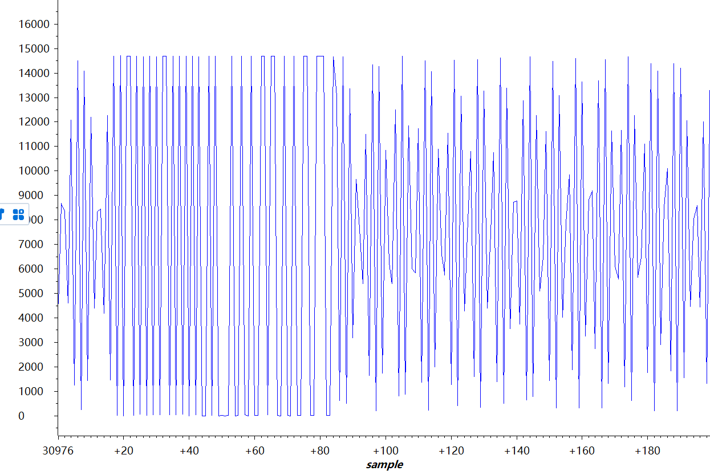

/* Timer_A Continuous Mode Configuration Parameter */

    连续计数模式配置
        const Timer_A_UpModeConfig upModeConfig =
        {
                TIMER_A_CLOCKSOURCE_ACLK,            // ACLK Clock Source
                TIMER_A_CLOCKSOURCE_DIVIDER_1,       // ACLK/1 = 32Khz
                16384,
                TIMER_A_TAIE_INTERRUPT_DISABLE,      // Disable Timer ISR
                TIMER_A_CCIE_CCR0_INTERRUPT_DISABLE, // Disable CCR0
                TIMER_A_DO_CLEAR                     // Clear Counter
        };
        注：结构体完整定义如下
            typedef struct _Timer_A_UpModeConfig
            {
                uint_fast16_t clockSource;
                uint_fast16_t clockSourceDivider;
                uint_fast16_t timerPeriod;
                uint_fast16_t timerInterruptEnable_TAIE;
                uint_fast16_t captureCompareInterruptEnable_CCR0_CCIE;
                uint_fast16_t timerClear;
            } Timer_A_UpModeConfig;

/* Timer_A Compare Configuration Parameter */

    比较器模式配置
        const Timer_A_CompareModeConfig compareConfig =
        {
                TIMER_A_CAPTURECOMPARE_REGISTER_1,          // Use CCR1
                TIMER_A_CAPTURECOMPARE_INTERRUPT_DISABLE,   // Disable CCR interrupt
                TIMER_A_OUTPUTMODE_SET_RESET,               // Toggle output but
                16384                                       // 16000 Period
        };
        注：结构体完整定义如下
            typedef struct _Timer_A_CompareModeConfig
            {
                uint_fast16_t compareRegister;
                uint_fast16_t compareInterruptEnable;
                uint_fast16_t compareOutputMode;
                uint_fast16_t compareValue;
            } Timer_A_CompareModeConfig;

这里我们可以直接转火到TimerA的分析 所以在整理到GitHub我把TimerA的介绍放在前面了

/* Statics */

    静态变量
        static volatile uint_fast16_t resultsBuffer[UINT8_MAX];
        static volatile uint8_t resPos;
            这里做一个解释
                static     ： static修饰全局变量，该变量只在本文件内被访问，不能在其他文件被直接访问，且表示静态存储，不会刷新、重新赋值。
                extern   ：表明变量或者函数是定义在其他其他文件中的,例如：extern int a;//显式的说明了a的存储空间是在程序的其他地方分配的，在文件中其他位置或者其他文件中寻找a这个变量。
                volatile ：volatile关键字是一种类型修饰符，用它声明的类型变量表示可以被某些编译器未知的因素更改，比如：操作系统、硬件或者其它线程等。遇到这个关键字声明的变量，编译器对访问该变量的代码就不再进行优化，从而可以提供对特殊地址的稳定访问。总之，声明此变量是易变的，用于基于硬件改变的变量（而非软件）。

/* Halting WDT  */（开始主函数部分）

    看门狗
            MAP_WDT_A_holdTimer();
            MAP_Interrupt_enableSleepOnIsrExit();
            resPos = 0;

/* Setting up clocks MCLK = MCLK = 3MHz ACLK = REFO = 32Khz */

    系统默认时钟设置，可能对应于timerA配置中的ACLK选择
        MAP_CS_initClockSignal(CS_ACLK, CS_REFOCLK_SELECT, CS_CLOCK_DIVIDER_1);

/* Initializing ADC (MCLK/1/1) */

    ADC时钟配置，这里又是MCLK了 MCLK约3MKHz，ACLK约32KHz 
        MAP_ADC14_enableModule();
        MAP_ADC14_initModule(ADC_CLOCKSOURCE_MCLK, ADC_PREDIVIDER_1, ADC_DIVIDER_1,ADC_NOROUTE);

/* Configuring GPIOs (5.5 A0) */

    引脚
        MAP_GPIO_setAsPeripheralModuleFunctionInputPin(GPIO_PORT_P5, GPIO_PIN5,GPIO_TERTIARY_MODULE_FUNCTION);

/* Configuring ADC Memory */

    配置为单通道模式 true==多次转换
        MAP_ADC14_configureSingleSampleMode(ADC_MEM0, true);

    配置ADC存储寄存器，电源电压为参考电压，非差分模式（false==ADC_NONDIFFERENTIAL_INPUTS）
        MAP_ADC14_configureConversionMemory(ADC_MEM0, ADC_VREFPOS_AVCC_VREFNEG_VSS, ADC_INPUT_A0, ADC_NONDIFFERENTIAL_INPUTS);

/* Configuring Timer_A in continuous mode and sourced from ACLK */

    增计数模式配置
        MAP_Timer_A_configureUpMode(TIMER_A0_BASE, &upModeConfig);

/* Configuring Timer_A0 in CCR1 to trigger at 16000 (0.5s) */

    CCR1配置，比较值，0.5s
        MAP_Timer_A_initCompare(TIMER_A0_BASE, &compareConfig);

/* Configuring the sample trigger to be sourced from Timer_A0  and setting it to automatic iteration after it is triggered*/

    采样触发，设置为依托Timer_A0的翻转，配置触发源 false表示是否翻转（否）
        MAP_ADC14_setSampleHoldTrigger(ADC_TRIGGER_SOURCE1, false);

/* Enabling the interrupt when a conversion on channel 1 is complete and enabling conversions */

    通道0，ADC模块，全局 三重中断设置，外加一个转换使能
        MAP_ADC14_enableInterrupt(ADC_INT0);
        MAP_ADC14_enableConversion();
        /* Enabling Interrupts */
         MAP_Interrupt_enableInterrupt(INT_ADC14);
        MAP_Interrupt_enableMaster();

/* Starting the Timer */

    启动定时器
        /* Starting the Timer */

/* Going to sleep */

    低功耗
        while (1)
        {
            MAP_PCM_gotoLPM0();
        }

/* This interrupt is fired whenever a conversion is completed and placed in ADC_MEM0 */

    当数据转换时，触发中断
        void ADC14_IRQHandler(void)
        {
            uint64_t status;
            status = MAP_ADC14_getEnabledInterruptStatus();
            MAP_ADC14_clearInterruptFlag(status);
            if (status & ADC_INT0)
            {
                if(resPos == UINT8_MAX)
                {
                   resPos = 0; 
                }
                resultsBuffer[resPos++] = MAP_ADC14_getResult(ADC_MEM0);
            }
        }

执行效果

    正点原子的示波器不行，但可以看出更新速度明显下降了，这个跟预设值有关
    
    预设值有2个，一个是计数模式的预设，一个是比较模式的预设，具体怎么研究，还有待考究
