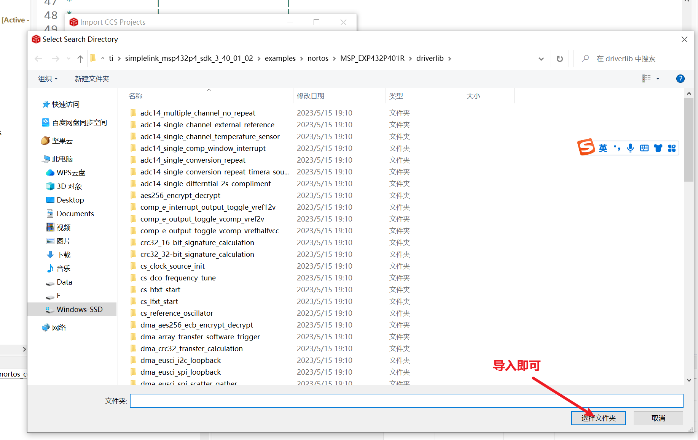

# 碎碎念

    本文既是笔者第一次撰写技术文章，也是笔者第一次使用GitHub上传技术文档。
    之后也准备在GitHub上持续输出，并进行电赛编程，学习
    之所以不在CSDN 是因为，太水了，大浪淘沙的地方。
    优先在GitHub和Gitee吧，之后有时间再进行同步开发公众号，CSDN。

## 第一版缺陷与不足

    1：timer32模块，PMAP模块，还有基础的GPIO配置，等等，只是做了初步说明。（小问题）
    2：DMA模块的分析和使用还没来得及处理，这个还是很重要的。
    3：外设模块还没研究，包括LCD或者OLED，ESP8266等
    4：自己开发的例程还没完成，目前仅限于官方例程的解读
    5：其他。
## 本文件使用指导
### 首先，例程在哪里呢

在你安装的SDK路径下

（源代码我就不上传了，因为我已经修改过了）

教大家怎么找 下面这个路径里是我的SDK路径

    C:\ti\simplelink_msp432p4_sdk_3_40_01_02\examples\nortos\MSP_EXP432P401R\driverlib
在导入工程中，导入该文件夹即可

然后勾选CCS的

注意，不要勾选gcc，会报错

### 其次，为啥要选择官方例程进行讲解？

    这是基础中的基础
    1：可以夯实基础，增强英文阅读能力
    1+：绝对标准，方便导入，不会报错。也不会出现什么固件库的问题，虽然即便是官方例程也有注释勘误，但毕竟金无足赤。
    2：可以事半功倍，直面核心代码自学，过滤掉网上良莠不齐的教学
    3：不会的全部可以问我 微信号w1228674605 我估计什么坑都踩了一遍 

### 最后，希望大家结合以下三个文档进行学习

我上传到了一个文件夹里（MSP432P401r_reference）

1：技术参考手册，也叫用户手册，文件名是slau356h

2：数据手册，文件名是msp432p401r

3：开发工具包，文件名是slau597f

## 讲一讲为啥会有这个工程
-------------------（"狗叫"一下吧，人生不"狗叫"如同白活）

    完工的时候，是考经济学的前一天。本人还没开始学习。
    这世界就是这么简单：
        一天复习，过了，那我写这GitHub就是魄力；挂了，就是莽夫与小丑
        MSP432学成了，包括后面的28335，28379D，以及暑假的FPGA，那这个GitHub工程就是封神之路的第一步；
        没学成，那也许就是别人眼里小丑吧，但确实是我珍贵的回忆
        是的，为了青春的底色，当小丑和莽夫，真的值得！
### 真·碎碎念

遥想公瑾当年，魏武挥鞭，东临碣石有遗篇

此非曹孟德之诗乎？

**达** 则 **挟天子以令诸侯，握敕令以制四方**

**穷** 则 **西望夏口，东忘武昌，山川相缪，郁乎**苍苍

**好好学下去吧，不计报酬，不谋绩点，只为留下青春的张扬与放荡。千秋功过，谁人曾与评说？**

嘴上都说不以成败论英雄，但就这学校的机制，你就是得拼命去卷，去拿奖。

去学那些皮，

去考那些毛。

皮都没学到，

考试考个毛？

但莫得办法，因为教育资源有限。

只能从 中考，高考，考研保研，考公

从一个黑暗森林，到另一个黑暗森林

荒谬但合理

人就是要有一种魄力：去他妈的礼制纲常——

我说的，就是礼制纲常！

#### 上李邕        唐·李白

    大鹏一日同风起，
    扶摇直上九万里。

    假令风歇时下来，
    犹能簸却沧溟水。

    世人见我恒殊调，
    闻余大言皆冷笑。

    宣父犹能畏后生，
    丈夫未可轻年少。

王雨声 微信号w1228674605  

------------------------------2023年6月12日  于卓创科技社团

    画一个饼干 6月20号之前 学完 C2000的TMS320F28335与LAUNCH-F28379D，并同步在GitHub与gitee发布第二个Git项目工程