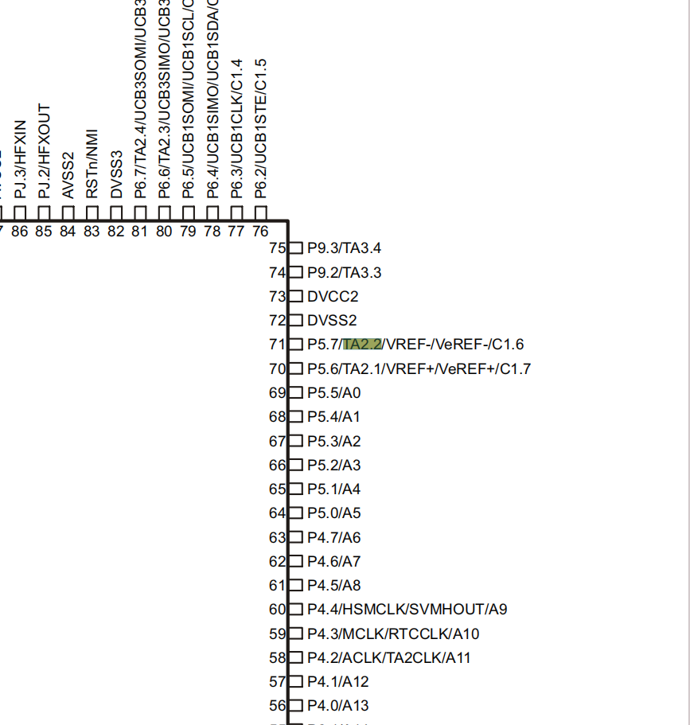
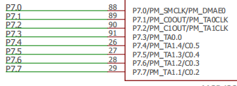
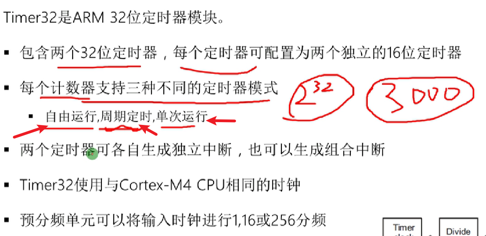

# 1-串口收发配置
## 串口收发软件配置
    1 初始化串口模块
        UART_initModule(EUSCI_Ax_BASE, &uartConfig);

    2 使能串口模块
        UART_enableModule(EUSCI_Ax_BASE);

    3  开启串口相关中断
        UART_enablelnterrupt(EUSCI_Ax_BASE,EUSCI_x_INTERRUPT);

    4 获取数据 
        UART_receiveData(EUSCI_Ax_BASE)；

    5 发送数据
        UART_transmitData(EUSCI_Ax_BASE，Data_8bit）；

    开启串口端口中断
        Interrupt_enableInterrupt(INT_EUSCIAx);

    开启总中断
        Interrupt_enableMaster(void);

    一般配置步骤
        0.配置时钟
        1.配置GPIO复用
        2.配置结构体
        3.初始化串口
        4.开启串口
        5.开启串口相关中断
        6.开启串口端口中断
        7.开启总中断
        8.编写UART ISR

## 串口收发硬件

# 2-定时器A 捕获
    一般配置步骤（使用连续计数模式）
    0.配置时钟
    1.复用引脚
         MAP_GPIO_setAsPeripheralModuleFunctionInputPin(CAP_PORT_PIN, GPIO_PRIMARY_MODULE_FUNCTION);

    2.配置连续计数结构体参数
        Timer_A_ContinuousModeConfig continuousModeConfig = {
                TIMER_A_CLOCKSOURCE_SMCLK,      // SMCLK Clock Source
                TIMER_A_CLOCKSOURCE_DIVIDER_48, // SMCLK/48 = 1MHz
                TIMER_A_TAIE_INTERRUPT_ENABLE,  // 开启定时器溢出中断
                TIMER_A_DO_CLEAR                // Clear Counte  
         };

    3.初始化定时器连续计数
        MAP_Timer_A_configureContinuousMode(CAP_TIMA_SELECTION, &continuousModeConfig);

    4.配置捕获结构体
         const Timer_A_CaptureModeConfig captureModeConfig_TA2 = {
                CAP_REGISTER_SELECTION,                      //在这里改引脚
                TIMER_A_CAPTUREMODE_RISING_AND_FALLING_EDGE, //上升下降沿捕获
                TIMER_A_CAPTURE_INPUTSELECT_CCIxA,           //CCIxA:外部引脚输入  （CCIxB:与内部ACLK连接(手册)
                TIMER_A_CAPTURE_SYNCHRONOUS,                 //同步捕获
                TIMER_A_CAPTURECOMPARE_INTERRUPT_ENABLE,     //开启CCRN捕获中断
                TIMER_A_OUTPUTMODE_OUTBITVALUE               //输出位值
            };

    5.初始化定时器为捕获
    6.选择模式开始计数
    7.清除中断标志位
    8.开启定时器端口中断
    9.开启总中断
    10.编写TIMA ISR

# 3-定时器A 中断
Timer_A的特性包括（做了解）:
    ◇具有4种操作模式的异步16位定时/计数器;
    ◇可选择和可配置的时钟源;
    ◇最多达7个可配置的捕获/比较模块;
    ◇具有PWM 功能的可配置输出;
    ◇异步输入和输出锁存

一般配置步骤
    0.配置时钟
    1.配置结构体
    2.初始化定时器A
        初始化定时器模块 
        Timer_A_configureUpMode(TIMER_Ax_BASE, &upConfig);

    3.选择模式开始计数
        Timer_A_startCounter(TIMER_Ax_BASE, TIMER_A_UP_MODE);

    4.清除比较中断标志位
        Timer_A_clearCaptureCompareInterrupt(TIMER_Ax, REGISTER_0);

    5.开启定时器端口中断
        Interrupt_enableInterrupt(INT_TAx_0);

    6.开启总中断
        Interrupt_enableMaster(void);

    7.编写TIMA ISR

分频计算公式如下 fclk一般为48Mhz

# 4-定时器A PWM输出

首先关注引脚号

    其实在器件概述中也讲述了32定时器的作用 但是有点尴尬。
    查找p401r.pdf

    查找slau356.h PWM的输出模式，对应三种技术模式

其次开始配置，一般配置步骤如下

    0.配置时钟
    1.配置GPIO复用
        MAP_GPIO_setAsPeripheralModuleFunctionOutputPin(GPIO_PORT_P7, GPIO_PIN7, GPIO_PRIMARY_MODULE_FUNCTION);（167）

    2.配置结构体
    
        Timer_A_PWMConfig TimA1_PWMConfig;           //Timer_A_PWMConfig TimA1_PWMConfig; 是在C语言中定义一个结构体变量的语句。
                                                                                                       //Timer_A_PWMConfig是一个结构体类型，而TimA1_PWMConfig是这个类型的一个变量。
这里强调一下

            typedef struct _Timer_A_PWMConfig   //这个配置具体可以在timer_a.h里看到
            {
                uint_fast16_t clockSource;       
                uint_fast16_t clockSourceDivider;//预分频值
                uint_fast16_t timerPeriod;                // 
                uint_fast16_t compareRegister;   //TIMER_A_CAPTURECOMPARE_REGISTER_1-6 用于多路PWM输出
                uint_fast16_t compareOutputMode; //输出模式 一般来说TIMER_A_OUTPUTMODE_TOGGLE_SET即可 看前面的介绍
                uint_fast16_t dutyCycle;  //占空比
            } Timer_A_PWMConfig;

            /*定时器PWM初始化*/
            TimA1_PWMConfig.clockSource = TIMER_A_CLOCKSOURCE_SMCLK;             //时钟源
            TimA1_PWMConfig.clockSourceDivider = psc;                            //时钟分频 范围1-64
            TimA1_PWMConfig.timerPeriod = ccr0;                                  //自动重装载值（ARR）
            TimA1_PWMConfig.compareRegister = TIMER_A_CAPTURECOMPARE_REGISTER_1; //通道一 （引脚定义）  TA1.1 对应P7.7
            TimA1_PWMConfig.compareOutputMode = TIMER_A_OUTPUTMODE_TOGGLE_SET;   //输出模式
            TimA1_PWMConfig.dutyCycle = ccr0;                                    //这里是改变占空比的地方 默认100%
            MAP_Timer_A_generatePWM(TIMER_A1_BASE, &TimA1_PWMConfig); /* 初始化比较寄存器以产生 PWM1 */   //写上定时器A1与结构体地址即可

    3.初始化定时器

PWM多路输出思路

    首先是void TimA1_PWM_Init(uint16_t ccr0, uint16_t psc)函数里的； 主函数里的是TimA1_PWM_Init(CCR0, CLKDIV); //第8讲 定时器A PWM    #define CCR0 20000 - 1     #define CLKDIV TIMER_A_CLOCKSOURCE_DIVIDER_48
            MAP_GPIO_setAsPeripheralModuleFunctionOutputPin(GPIO_PORT_P7, GPIO_PIN7, GPIO_PRIMARY_MODULE_FUNCTION); //通道1
            MAP_GPIO_setAsPeripheralModuleFunctionOutputPin(GPIO_PORT_P7, GPIO_PIN6, GPIO_PRIMARY_MODULE_FUNCTION); //通道2
        接下来的配置同上
          //第1路 PWM      
            MAP_Timer_A_generatePWM(TIMER_A1_BASE, &TimA1_PWMConfig); /* 初始化比较寄存器以产生 PWM1 */

            //第2路 PWM  
            User_TimA1_PWMConfig->compareRegister = TIMER_A_CAPTURECOMPARE_REGISTER_2; //通道2 （注意引脚定义）
            MAP_Timer_A_generatePWM(TIMER_A1_BASE, &TimA1_PWMConfig);                  /* 初始化比较寄存器以产生 PWM2 */

    然后是main函数里的
                MAP_Timer_A_setCompareValue(TIMER_A1_BASE, TIMER_A_CAPTURECOMPARE_REGISTER_1, CCR1); //通过更改传入的CCR1来改变通道1占空比
                MAP_Timer_A_setCompareValue(TIMER_A1_BASE, TIMER_A_CAPTURECOMPARE_REGISTER_2, CCR2); //通过更改传入的CCR2来改变通道2占空比

    注意：
        1：TA1的8.0的位置在slau597f.pdf里可以找到  它在Ti的板子上的丝印是3.0 有点尴尬，可以看出来不具备PWM功能（没有"PW_TA1.x"语句）

# 5-外部中断配置

**开启中断**

    GPIO_enableInterrupt(GPIO_PORT_Px, GPIO_PINx);

触发方式选择

    GPIO_interruptEdgeSelect(GPIO_PORT_P1, GPIO_PIN4, Edge);
    Edge有效值 
        GPIO_HIGH_TO_LOW_TRANSITION
        GPIO_LOW_TO_HIGH_TRANSITION

获取已使能的GPIO中断状态

    GPIO_getEnabledInterruptStatus(GPIO_PORT_Px);

 清除GPIO中断标志位

    GPIO_clearInterruptFlag(GPIO_PORT_Px, GPIO_PINx);

开启总中断

    Interrupt_enableMaster(void);

开启端口中断

    Interrupt_enableInterrupt(interruptNumber);

一般配置步骤

    1.配置GPIO输入
    2.清除中断标志位
    3.配置触发方式
    4.开启外部中断
    5.开启端口中断
    6.开启总中断
    7.编写GPIO ISR

中断优先级配置（暂时用不着，有需要再看
<https://www.bilibili.com/video/BV1Rb4y1z7KJ?p=10&spm_id_from=pageDriver&vd_source=f55e9b0a7c1da847b04085ba57aed552>）

# 6-Timer32学习（没必要）

从下图可以看出，没啥用

对比TimerA

**建议看看物联世界视频，然后再次熟悉一下中断配置**

# 完结

